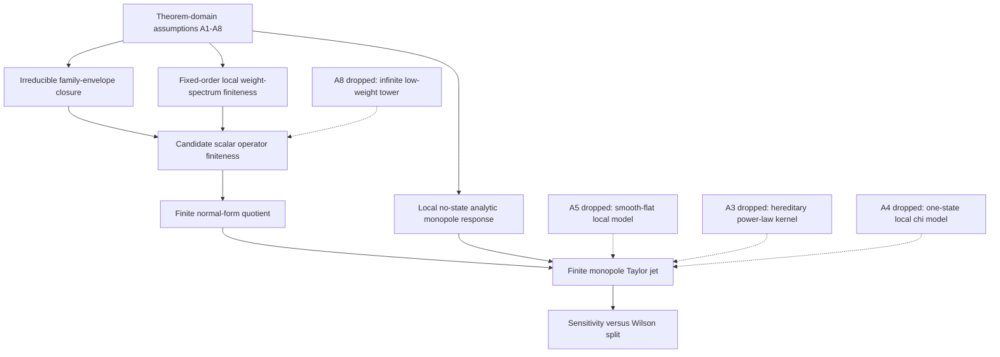

# Theorem Dependency Map

- Status: Note. This note gives the compact dependency graph for the closed free-fall theorem package.
- Status: Proven. It is paper-facing and records only the final theorem-layer structure.

## Layer Summary

| Layer | Status | Closed statement | First sharp escape if assumption dropped |
| --- | --- | --- | --- |
| Irreducible family-envelope closure | Proven | Primitive-family closure on audited scalar, vector, and STF classes | No explicit non-STF survivor remains in the current theorem domain |
| Candidate operator finiteness | Proven | Finite below the fixed cutoff once the local weight spectrum is finite | `A8` infinite low-weight tower |
| Finite normal-form quotient | Proven | Finite-dimensional after the explicit reductions are imposed | No separate sharper escape is promoted inside the frozen domain |
| Finite monopole jet | Proven | Finite Taylor jet in finitely many normal-form coordinates | `A5`, `A3`, or `A4` depending on which assumption is dropped |
| Sensitivity versus Wilson split | Proven | Monopole sensitivities remain separate from higher-multipole Wilson data | `A3` or `A4` once local Y-only reduction fails |

## Reading Rule

- Status: Proven. The positive theorem is the chain `A1-A8 -> envelope closure -> operator finiteness -> finite quotient -> finite jet -> sensitivity/Wilson split`.
- Status: Proven. The boundary-escape map records the smallest exact place where that chain breaks when one assumption is dropped.
