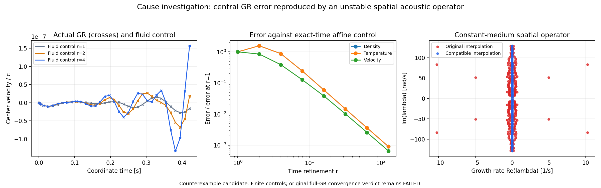

# GR 시간 수렴 실패의 원인 추적 (2026-09-14)

분류: Counterexample candidate. 중심부의 시간 수렴 실패를 재현했고, 원래 비균일 격자의 압력 기울기–속도 발산 조합에서 인위적인 음향 성장 모드를 분리했다. 초기 운동량 불균형이 이 모드를 구동하고, 39/78/156단계의 서로 다른 감쇠·위상 오차가 끝점 차이를 비단조적으로 만든다는 설명이 유한 대조와 일치한다. 원래 전체 GR 판정은 실패로 보존한다. 내부 셀 3142의 전역 밀도·온도 최대 오차까지 원인이 모두 해소됐다는 주장은 하지 않는다.

## 실제 실패의 재현

분류: Counterexample candidate. 같은 초기 상태, 실제 유한체적 유속과 계량 재구성, native EOS의 밀도·온도 미분을 유지한 중심부 유체 대조를 만들었다. 열유속과 조성의 섭동은 고정하고, 선택한 영역 밖의 섭동은 0으로 둔다. 정지 상태의 donor 경계에서는 대칭 유한차분을 사용한다. 이는 실패 뒤 선택한 원인 분리 대조이며 원래 생산 모형이나 수렴 문턱을 바꾸지 않는다.

| 중심 16셀의 끝점 차이 재현 상대 오차 | 밀도 | 온도 | 속도 |
| --- | ---: | ---: | ---: |
| 정밀도 1–2 | 0.0243% | 0.1070% | 0.0317% |
| 정밀도 2–4 | 0.0367% | 0.0832% | 0.0305% |

분류: Counterexample candidate. 위 값은 각 변수에서 실제 GR의 세분도 간 차이와 대조의 차이 사이의 최대 절대 편차를, 실제 차이의 최댓값으로 나눈 것이다. 단순히 최댓값 하나가 비슷한지만 확인한 것이 아니다. 영역을 128셀에서 256셀로 늘렸을 때 39개 공통 시각, 중심 16셀의 전체 이력 변화는 정밀도 1–32에서 상대 1.86e-12 미만이었다. 영역 경계에서 중심 16셀까지의 초기 음향 통과 시간은 각각 1.879초와 2.659초이며 실행 시간은 0.421초다. 계량의 비국소 영향은 이 통과 시간만으로 배제하지 않고 실제 영역 확대 대조로 확인했다.

분류: Counterexample candidate. 원래 3개 경로의 초기 배열은 같았다. 중심·내부·외층에서 선택한 8개 셀, 초기/세 끝점의 32개 native EOS 및 불투명도 재계산은 저장된 30개 보조 값의 모든 원소와 정확히 같았다. 이 표본에서는 캐시 불일치가 없었으며, 전체 EOS 물리 인증이나 모든 경로 지점의 재계산을 뜻하지 않는다. 유체 대조 행렬의 방향 미분 확인은 공간 항 최대 상대 차이 1.13e-6, 질량 항 6.35e-14 미만으로 통과했다.

## 공간 이산화에서 확인한 결함

분류: Proven. 일정 매질의 선형 음향 대조에서 셀 부피 행렬을 V, 속도 발산을 D, 압력 기울기를 G라 두면, 양의 이차 에너지의 보존 조건은 VG = -DᵀV이다. 이 절의 p, v는 같은 에너지 척도로 규격화한 선형 음향 변수다. 내부 공유 면에서 원래 보간은 속도와 압력 모두 같은 위치 가중치 t를 사용한다.

~~~text
v_f = (1-t) v_L + t v_R
p_f = (1-t) p_L + t p_R
~~~

분류: Proven. 원래 셀 압력의 구면 기하 항을 함께 사용하면 그 면의 이차 에너지 변화에 남는 항은 다음과 같다. c_s는 이 대조의 일정 음속, A_f는 면적이다.

~~~text
dE_acoustic/dt |_face
  = -c_s A_f (1-2t) (p_L-p_R) (v_L-v_R)
~~~

분류: Proven. 이 항의 부호는 정해지지 않으며 t=1/2가 아닌 면에서는 에너지를 주입할 수 있다. 압력 가중치만 p_f = t p_L + (1-t) p_R로 바꾸면 같은 유한 음향 대조에서 내부 면 항이 정확히 0이다. 이는 해당 선형 대조의 대수적 항등식이며, 전체 GR의 EOS·중력·열수송에 그대로 적용할 수 있다는 정리는 아니다. 기호 전개와 실제 행렬의 가중 수반 항등식을 모두 확인했다.

분류: Counterexample candidate. 원래 항성의 중심 격자만 사용하고 EOS·중력을 제거한 일정 음속 1.16e8 cm/s 대조에서도 다음 성장률을 얻었다. 유체 대조에서 얻은 주된 성장 모드 10.283357 ± 83.851558 i s⁻¹와 가까운 값이다.

| 셀 수 | 원래 공간 연산자의 최대 성장률 [s⁻¹] | 호환 압력 보간의 최대 실수부 절댓값 [s⁻¹] |
| --- | ---: | ---: |
| 64 | 10.231252 | 1.42e-14 |
| 128 | 10.231252 | 1.69e-14 |
| 256 | 10.231252 | 4.96e-14 |

분류: Counterexample candidate. 호환 보간은 VG = -DᵀV를 실제 배열에서 상대 1.92e-16 미만으로 만족했다. 중심 영역을 늘려도 원래 성장률은 유지됐다. 따라서 이 유한 대조의 성장을 EOS 오류나 원격 외부 경계의 효과로 설명할 필요가 없다. 압력과 속도에 같은 비대칭 면 가중치를 쓰는 공간 조합 자체가 원인을 제공한다.

구현 위치: verification/gr_coupled_evolution.py의 faces (135–142줄), verification/gr_conservative_two_carrier.py의 압력 운동량 면 유속 (44–50줄) 및 셀 압력 기하 원천항 (133–136줄). 기존 생산 소스와 모든 경로 자료는 수정하지 않았다.

## 시간 간격이 실패를 드러낸 방식

분류: Counterexample candidate. 유체 대조의 초기 중심 운동량 잔차는 6.7059231323e-7 s⁻¹이다. 초기 운동량 잔차만 구동으로 남긴 해는 전체 구동의 중심 응답과 상대 6.61e-13 미만으로 일치했다. 따라서 이 대조의 중심 진동은 초기 압력–중력의 이산 불균형이 구동한다. 초기 잔차를 임의로 빼는 방식은 이번에 적용하지 않았다.

분류: Counterexample candidate. 같은 유한 선형계의 시간 해를 행렬 지수로 계산했다. 고유모드 전개와의 끝점 대조는 상대 6.57e-12 미만이었다. 원래 BE 시작 및 가변 BDF2 절점을 더 세분화하면 시간 오차가 다음처럼 2차 수렴으로 돌아온다.

| 정밀도 변화 | 밀도 차수 | 온도 차수 | 속도 차수 |
| --- | ---: | ---: | ---: |
| 1→2 | -0.650 | -0.650 | 0.238 |
| 2→4 | 0.845 | 0.845 | 1.136 |
| 4→8 | 1.854 | 1.854 | 1.613 |
| 16→32 | 2.023 | 2.023 | 1.916 |
| 64→128 | 2.006 | 2.006 | 1.988 |

분류: Counterexample candidate. 위 표는 같은 선형계의 시간 해에 대한 오차 차수이며 원래 GR의 세 경로 차수와 다른 값이다. 더 작은 시간 간격은 불안정한 공간 계 자체를 더 정확하게 적분한다. 따라서 이 대조의 시간 수렴만으로 실제 항성 진화가 물리적으로 옳다고 판정할 수 없다. 기존 누적 총에너지 보존 통과 역시 이 양의 음향 이차 에너지의 안정성을 검사한 것은 아니다.

## 수정의 우선순위와 남은 경계

분류: Conjectural. 실제 수정은 압력–속도 공유 면의 일·에너지 관계와 초기 압력–중력 평형의 이산 일치부터 해결해야 한다. 수정은 실제 GR의 바리온·총에너지·운동량·26종·두 열유속 전체에 일관되게 연결해야 하며, 이 일정 매질 대조의 보간 교체만으로 전체 수정이 끝났다고 판단하면 안 된다.

분류: Conjectural. 이후 실제 native EOS를 포함한 국소 결합 진화로 중심 성장과 내부 셀 3142 부근의 조성 경계 오차를 확인하고, 수정된 공간 연산자에서 전체 시간 세분화 경로 및 기존 보존·잔차·특성속도 문턱을 다시 통과해야 한다. 전체 생산 재계산은 이번 원인 추적에서 시작하지 않았다. 원래 39/78/156단계와 passed=false는 유지한다.

분류: Counterexample candidate. 이번 결과는 실제 중심부 실패를 재현하고 수정 대상인 공간 연산자를 특정한 loophole progress다. 분류: Proven. 일정 매질 음향 대조의 공유 면 항등식은 제한된 theorem progress다. 물리 EOS 인증, 분자 EOS 전체 보존 초기화, 연속 오차 보증, 대기·외부·반응·실제 구동·관측 연결은 이 결과로 완료되지 않는다.

## 재현과 자료

- verification/gr_time_convergence_cause.py --cells 128 --workers 15 및 --cells 256 --workers 15
- verification/gr_time_convergence_cause_spectrum.py
- verification/gr_acoustic_adjoint_cause.py
- outputs/direct-eos-gr33/gr-time-cause-central-128/ 및 gr-time-cause-central-256/
- outputs/direct-eos-gr33/gr-acoustic-adjoint-cause/result.json, spectra.npz, cause.png, manifest.json

실행은 CPU 0–15 범위와 OPENBLAS_NUM_THREADS=1을 사용했다. 완성된 경로의 파일 해시와 계획의 소스 연결을 확인했다. 각 실행은 이미 존재하는 출력 경로를 덮어쓰지 않는다.

렌더링 운영 기록: 공간 대조의 모든 수치·기호 검사는 완료됐으나 마지막 Matplotlib import에서 사용자 NumPy 2와 시스템 Matplotlib의 ABI 불일치가 발생했다. 수치 결과를 다시 계산하지 않고 동일 소스의 plot 함수만 시스템 python3 -s/NumPy 1.21.5에서 실행했다. render-recovery.json에 분리 기록했다.

