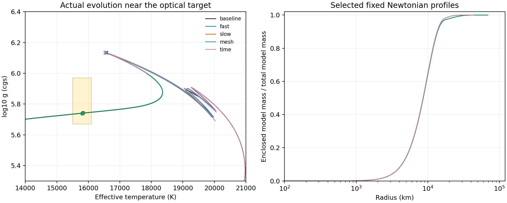

# Request 20 — 열 WD 후보의 민감도와 GR 질량 정의

작업 전 체크포인트: `389eaef`. 실행 계획은 `outputs/thermal-robustness20/preregistered-plan.json`에 결과 확인 전 결속했다.

## 고정한 검사

분류: Imported from prior work. Request 19는 원래 MESA 진화의 1,000단계와 내부 구조를 재현했고, 한 외피 제거율에서 Newtonian GM·온도·표면중력 조건을 함께 만족한 실제 진화 시점 11개를 확보했다. 이 시점들은 한 형성 모형에서 나온 후보이며 GR 질량 일치나 관측 우도 적합을 뜻하지 않는다.

분류: Counterexample candidate. 이번 검사는 같은 공개 photo18000에서 다음 네 가지를 각각 바꾼다. 제거율은 원래 태양질량/년 단위다. 내부 `relax_mass`는 나이·모델 번호를 복원하는 모형 구성 절차이며 실제 쌍성의 질량 손실 이력으로 간주하지 않는다.

| 실행 | log10 최대 제거율 | mesh_delta_coeff | max_dq | binary varcontrol |
|---|---:|---:|---:|---:|
| 기존 기준 | −6 | 0.8 | 0.001 | 2e−5 |
| fast | −5 | 0.8 | 0.001 | 2e−5 |
| slow | −7 | 0.8 | 0.001 | 2e−5 |
| mesh | −6 | 0.4 | 0.0005 | 2e−5 |
| time | −6 | 0.8 | 0.001 | 1e−5 |

분류: Counterexample candidate. 검사 나이 구간은 5,717,152,444.855436–5,732,508,779.985576년으로 고정했다. GM/기준 GM_sun=0.197536385307의 상대 수치 오차 1e−8 이내, Teff=15800±300 K, logg=5.82±0.15를 모두 요구한다. 모든 통과 행을 보존하고 그 안에서 표준화 거리 제곱이 최소인 실제 구조를 고른다. 통과 행이 없으면 질량 조건을 만족한 행 중 최소값을 보존하며 실패를 성공으로 바꾸지 않는다. 이 거리는 우도나 posterior가 아니다. 반지름을 logg와 독립인 관측량으로 중복 계산하지 않는다.

분류: Counterexample candidate. 네 실행 모두 고정 종료 나이까지 정상 종료하고 각각 실제 통과 행이 있어야 이번 유한 변형 검사를 통과한 것으로 판정한다. 같은 모델 번호로 비교하지 않는다. 공통 나이의 501개 점과 모든 Teff=15800 K 교차를 이력의 선형 보간으로 비교하되, 보간된 내부 구조나 실제 관측 시점으로 사용하지 않는다. 네 실행은 독립 형성 모형 네 개가 아니며 연속 극한의 수렴 증명이 아니다.

분류: Proven. 출력만 줄인 10단계 양성 대조에서 모든 물리 이력 열과 시작·종료의 공통 구조 열이 기준 실행과 일치했다. 최초 계획의 “모든 이력 열”에는 계산 시간 열도 포함되어 있었으나 `runtime_minutes`만 달랐다. 이 비물리 실행 계수의 차이를 대조 감사 파일에 그대로 보존했고, 다른 차이를 허용하지 않았다. 핵종 22개와 질량·열·회전 구조, 내부에너지 및 질량 보정 열은 매 단계 저장한다.

## 질량 정의 소스 감사

분류: Proven. 검증된 MESA r7624 ZIP의 정확한 소스와 배포 데이터에 다음 경로를 결속했다. 현재 버전 문서를 과거 실행의 구현으로 대신하지 않았다. [배포본](https://zenodo.org/records/2630796).

1. `chem/public/chem_lib.f90`의 `get_composition_info`는 조성을 바리온 분율 X_i로 정의하고, C_X=Σ X_i W_i/A_i를 계산한다. W_i는 배포 `isotopes.data`의 원자량이다.
2. `star/private/star_utils.f90`의 `set_m_grav_and_grav`는 `use_mass_corrections=false`일 때 m_grav=m, true일 때 Σ C_X dm을 쓴다. 내부에너지와 중력 결합에너지, 고유 부피 적분이 이 합에 들어 있지 않다.
3. `use_gr_factors`는 이 버전에서 압력식 등에 (1−2Gm/rc²)의 제곱근 인자를 적용한다. `use_mass_corrections`를 켜면 압력식에는 C_X+P/(ρc²) 항도 들어간다. 이 항이 존재함을 인정하더라도, 내부에너지를 포함한 질량 적분과 아래의 완전한 TOV 구조식이 구현된 것으로 취급할 수 없다.
4. `eos/public/eos_def.f`의 lnE는 단위 질량당 내부에너지다. 표의 절대 기준과 원자량·전자 정지에너지 기준의 일관성을 확정하기 전에는 ρc²에 임의로 더해 실제 중력질량을 확정하지 않는다.

분류: Imported from prior work. 정적 구대칭 완전유체의 GR 기준은 ε를 총 에너지 밀도로 놓은 다음 식이다. 원래 회전·열 진화 구조에 적용하려면 별도의 가정과 구조 재계산이 필요하다. [Pretel·da Silva (2020), 식 4–9](https://doi.org/10.1093/mnras/staa1493).

\[
 m'=4\pi r^2\epsilon/c^2,\qquad
 P'=-\frac{G(\epsilon+P)(m+4\pi r^3P/c^2)}
 {c^2r^2(1-2Gm/rc^2)},\qquad M=m(R).
\]

분류: Proven. 같은 정적 구대칭 가정에서 보존된 바리온 수는 고유 부피를 적분한 N_B=∫4πr²n_B(1−2Gm/rc²)^(−1/2)dr이다. 지정한 기준 바리온 질량 m_ref에 대해 M_B=m_ref N_B를 정의해야 한다. Newtonian 질량 좌표나 원자량 보정 합을 이 적분과 자동으로 동일시할 수 없다. 회전하는 경우에는 대응하는 시공간과 보존 전류를 사용해야 한다.

분류: Proven. 위 두 식을 나누고 ε=ρ_B(C_Xc²+e)라는 기준을 명시하면, 완전한 정적 식은 다음과 같다. 구대칭·정역학·광학적으로 두꺼운 내부의 해당 MESA 압력 경로와 비교할 때 e/c² 항 및 4πr³P/c² 항이 추가로 필요하다. MESA 좌표가 고유 바리온 질량이라고 가정해 주더라도 남는 차이이며, 그 좌표 동일성 자체도 별도로 확인해야 한다.

\[
 \frac{dP}{dM_B}=-\frac{G}{4\pi r^4\sqrt{1-2Gm/(rc^2)}}
 \left(C_X+\frac{e+P/\rho_B}{c^2}\right)
 \left(m+\frac{4\pi r^3P}{c^2}\right).
\]

분류: Proven. Newtonian 열역학의 P=ρ_B²∂e/∂ρ_B에서 밀도·엔트로피·조성에 무관한 상수 δ를 e에 더해도 P와 그 미분은 바뀌지 않는다. 그러나 정지에너지 기준을 고정한 ε=ρ_B(c²+e)는 ρ_Bδ만큼 바뀐다. 따라서 압력과 Newtonian 열역학 미분만으로 절대 GR 에너지 완성을 유일하게 정할 수 없다. 이는 총 ε를 보존하는 단순 기준 재정의와 구별되며, 출처에 맞춘 절대 에너지 완성이 불가능하다는 정리도 아니다. 기호 검사가 이 두 항등식을 직접 확인한다.

## 내부에너지와 결합에너지 진단

분류: Proven. 구각의 반지름 경계를 a,b, 안쪽 누적 질량을 m_a, B=Δm/(b³−a³)라 하면, 구각 안에서 m(r)=m_a+B(r³−a³)로 정의한 고정 밀도 모형의 Newtonian 결합에너지는 다음과 같다.

\[
 W_{ab}=-3GB\left[(m_a-Ba^3)\frac{b^2-a^2}{2}
                  +B\frac{b^5-a^5}{5}\right].
\]

분류: Proven. 균일 각속도 Ω를 각 구각에 부여한 구대칭 회전 진단은 T_ab=Ω²B(b⁵−a⁵)/5다. 각 구각의 내보낸 내부에너지 e_i에 대해 U=Σe_iΔm_i를 별도로 계산한다. 얇은 구각의 W는 같은 식을 b−a의 다항식으로 전개하여 상쇄를 피했다. 직접 기호 적분과 균일 구의 W=−3GM²/(5R), T=MR²Ω²/5를 독립 대조했다.

분류: Proven. 이 값들은 고정된 Newtonian 출력의 진단이다. C_X 보정, U, W, T를 합산한 값을 인증된 ADM 보정이라고 부르지 않는다. 열 EOS의 절대 에너지 기준, 고유 부피, 구조 반작용, 회전 metric이 아직 완성되지 않았기 때문이다.

## 실행과 재검증

생산자는 `verification/thermal_robustness.py`다. 새 캐시에서 `prepare`, `run control`, `control`을 먼저 실행한 뒤 `run fast`, `run slow`, `run mesh`, `run time`을 실행한다. 이미 실행한 디렉터리는 덮어쓰지 않는다. 작업 경로는 WSL `/home/lpaiu/work/thermal-robustness20`, 기존 MESA·SDK는 `/home/lpaiu/work/thermal-restart19`를 재사용한다. `sources`는 배포 소스에 대한 바이트 대조, `symbolic`은 기호 대조, `analyze`는 실행 완료 후 실제 구조 선택과 응답 계산을 수행한다.

후속 나이 검사는 `prepare_phase`, 두 직접 실행의 실패 확인, `prepare_phase_replay`, `run fast_phase_replay`, `run time_phase_replay`, `analyze_phase` 순서다. 최종 생성 순서는 `analyze`, `profile_bound`, `plot`, `check`, `check_phase`, `report`, `report_phase`, `maintain`, 원고 검증, `seal`, `verify`다. `maintain`은 이전 문서의 스냅샷을 먼저 만들며 중복 실행하지 않는다.

그림만 WSL 안에서 `PYTHONPATH= python3 -s verification/thermal_robustness.py plot`으로 생성한다. 기존 시스템 Matplotlib의 NumPy 1.x ABI를 사용하며 과학 계산의 NumPy 2 환경은 바꾸지 않았다. 그림과 과학 계산의 실제 버전·모듈 경로·해시는 각각 `plot-provenance.json`, `provenance.json`에 기록한다.

저장된 증거의 재검증 명령은 다음과 같다.

```powershell
rtk proxy wsl -d Ubuntu-22.04 -- bash -lc 'cd /mnt/e/lab/self-mass-unobservability && export PYTHONPATH=/home/lpaiu/work/nutimo_pilot/request13_deps && python3 verification/thermal_robustness.py check && python3 verification/thermal_robustness.py check_phase && python3 verification/thermal_robustness.py verify'
```

분류: Proven. 기존 로컬 해시 감사에는 Git 직렬화 경계의 누락이 있었다. 추적된 일반 파일 1,877개를 실제 Git blob과 대조한 결과 63개가 작업 폴더와 달랐으며, 전부 줄바꿈 차이였다. 일부 역사적 문서와 산출물의 해시는 검증된 작업 폴더 바이트에 결속되어 있었으므로 기존 Git 내보내기는 같은 해시를 보존하지 못했다. 실패를 `git-byte-audit-before.json`에 보존했다.

분류: Proven. `.gitattributes`에 바이트 보존 규칙을 넣고 해당 63개 파일의 검증된 원래 바이트를 Git에 저장했다. 작업 폴더의 과학 파일·값·역사적 manifest 바이트는 바꾸지 않았다. 줄바꿈을 무시한 차이는 속성 규칙 3줄뿐이다. 보정 체크포인트 `b3a8944`를 새 디렉터리에 Git archive로 추출한 후 Request 19의 현재·역사적 SHA 773개 검사가 통과했다. 이번 연구도 같은 방식으로 Git 내보내기를 재검증한다.

## 고정 밀도 구조 사이의 정적 응답 상계

증명 전 체크포인트: `9b006eb`.

분류: Proven. 두 양의 구대칭 퍼텐셜 V_i=4π|β|Gρ_i/c²를 공통 반지름 구간에 영으로 연장한다. 영 배경에서 단위 외부장에 대한 정적 선형 scalar 문제는 φ_i=1+K_iφ_i이며, K_i f(r)=∫s²V_i(s)f(s)/max(r,s) ds다. β=−4, 평탄 시공간, 고정 밀도라는 기존 조건을 유지한다. η_i=∫sV_i ds<1이면 양의 Neumann 급수로 해가 유일하고 ||φ_i||∞≤1/(1−η_i), ||φ_i−1||∞≤η_i/(1−η_i)다. 이 φ_i는 영 배경 주변의 선형 응답이며 유한 비영 배경의 비선형 별 해가 아니다.

분류: Proven. Q_i=∫s²V_i ds, D_η=∫s|V_1−V_2|ds, D_Q=∫s²|V_1−V_2|ds라 놓는다. 두 방정식을 빼고 resolvent의 노름을 적용하면 ||φ_1−φ_2||∞≤D_η/[(1−η_1)(1−η_2)]다. 정적 응답 χ_i=∫s²V_iφ_i ds를 차분하고 상수항을 먼저 분리하면

\[
 |\chi_1-\chi_2|\le |Q_1-Q_2|
 +\frac{D_Q\eta_1}{1-\eta_1}
 +\frac{Q_2D_\eta}{(1-\eta_1)(1-\eta_2)}.
\]

분류: Proven. 지표 1,2를 바꾼 상계도 성립하므로 둘 중 작은 값을 쓴다. 질량이 같으면 Q_1=Q_2이고 선도 질량 차이가 정확히 소거된다. 두 구각 격자의 합집합에서 V_1−V_2를 적분하고 65자리 구간 연산으로 위 상계를 바깥 방향으로 계산한다. 이 정리는 두 고정된 구조의 응답 차이를 보장한다. 어느 구조가 실제 별에 더 가까운지, MESA 격자 오차가 얼마인지, 유체 결합이나 비선형 관측 미분이 정확한지까지 보장하지 않는다.

## 실행 결과

분류: Counterexample candidate. 고정 나이 구간의 유한 변형 검사 미통과. 아래 값은 각 실행의 실제 선택 구조다. 통과 행이 없는 실행은 질량 조건 안의 최선 행을 표시하며 후보로 승격하지 않는다.

| 실행 | 진화 행 | 조건 통과 행 | 모델 | 셀 수 | Teff (K) | logg | 나이 (년) |
|---|---:|---:|---:|---:|---:|---:|---:|
| baseline | 1500 | 11 | 19057 | 3011 | 15828.0413 | 5.7416254 | 5732507223.876472 |
| fast | 1239 | 0 | 19163 | 2748 | 16569.0988 | 6.1347644 | 5729879250.140440 |
| slow | 2591 | 11 | 18931 | 3004 | 15824.9460 | 5.7398734 | 5732472418.071473 |
| mesh | 2737 | 14 | 19041 | 5735 | 15802.1130 | 5.7395912 | 5732487253.441338 |
| time | 1850 | 0 | 19759 | 2760 | 16535.2182 | 6.1365646 | 5730038245.456920 |

분류: Proven. 각 실행의 Teff=15800 K 교차는 `selection.json`에 가열·냉각 방향과 두 실제 모델 번호를 함께 보존했다. 공통 나이 501개 표본의 보간 차이는 `common-age-comparison.json`에 있다. 이 표본의 최대 차이를 전구간 엄밀 최대 오차로 해석하지 않는다.

분류: Counterexample candidate. 다음 그림은 원래 고정 구간 실행만 표시한다. 음영은 사전 탐색 사각형이며 확률 등고선이 아니다. 원은 통과한 선택 구조, X는 통과하지 못한 최선 구조다.



분류: Proven. 각 선택 구조의 영 배경·고정 밀도 scalar 결과는 다음과 같다. 구조 차이 상계는 기존 기준 구조와의 차이이며, 시간 분해능 오차 인증이 아니다. 표는 표시용 반올림 값이며 엄밀한 바깥 방향 상계는 JSON 원문에 보존했다.

| 실행 | chi (m) | 궤도 주파수 상대 차이 상계 | 기준 구조와 chi 차이 상계 (m) |
|---|---:|---:|---:|
| fast | 1166.887223346 | 1.879584683e-10 | 7.741934248e-03 |
| slow | 1166.885314672 | 2.090139562e-10 | 1.612026326e-04 |
| mesh | 1166.885304860 | 2.090368708e-10 | 3.041713430e-04 |
| time | 1166.887248251 | 1.878997252e-10 | 7.767194527e-03 |

분류: Proven. 선택 구조의 질량·에너지 진단은 다음과 같다. 모든 수는 무차원이며 마지막 두 에너지는 Mc²로 나눈 값이다. C_X는 배포 원자량과 22개 조성에서 독립 재계산했다.

| 실행 | 가중 평균 C_X−1 | U/(Mc²) | W/(Mc²) |
|---|---:|---:|---:|
| fast | 7.068722085e-04 | 7.412148148e-06 | -1.483998850e-05 |
| slow | 7.064624428e-04 | 7.308360197e-06 | -1.463554529e-05 |
| mesh | 7.064560358e-04 | 7.307830012e-06 | -1.463449430e-05 |
| time | 7.068609072e-04 | 7.413500339e-06 | -1.484265607e-05 |

분류: Conjectural. 다음 완료 경계는 절대 에너지 기준을 결속한 열 EOS와 상대론적 구조·질량 재계산이다. 한 초기 모형의 유한 변형 시험은 전체 형성 이력의 강건성이나 연속 격자 극한을 인증하지 않는다. 실제 궤도에 맞는 형성 모형, 유체·metric·scalar 결합, 전구간 미분 오차, 전체 관측 비선형 추론도 미완료다. 이번 결과를 논문 제출 준비 완료로 판정하지 않는다.

재검증은 저장된 증거만 사용하여 `thermal_robustness.py check`와 `thermal_robustness.py verify`를 실행한다. `check`는 감사 파일을 같은 내용으로 재생성하며 `verify`는 현재 및 역사적 해시를 읽기만 한다. 기존 원고 PDF·ZIP은 Request 12 동결본이며 이번 추가 연구를 아직 포함하지 않는다.

## 고정 구간 실패 뒤 사전 등록한 후속 나이 검사

분류: Proven. 빠른 제거율과 세밀한 시간 설정의 고정 구간 실패를 확인한 뒤 별도 `phase-plan.json`을 등록했다. 기준 질량·온도·표면중력은 그대로 두고, 원래 종료 나이 이후 다음 냉각에서 Teff<15500 K가 될 때까지 검사한다. 추가 1천만 년과 최대 모델 40000의 중단 한도를 두었다. 이 후속 결과는 원래 유한 변형 검사의 실패 판정을 바꿀 수 없다. 후속 작업 전 체크포인트는 `8b95a41`이다.

분류: Proven. 정확한 종료 사진은 dt_next=0을 저장하여 두 직접 재시작이 진화 없이 종료했다. 실패 로그를 보존하고, 첫 후속 진화 결과를 얻기 전에 `phase-restart-repair.json`에 직전 정상 사진 사용을 명시했다. 바이너리 사진의 숫자를 직접 고치지 않았다. 기존 종료 나이에 맞춰 잘린 마지막 단계는 재생 대조에서 제외했다.

분류: Proven. fast의 직전 사진 재생에서 구조 37개 열과 기존 이력 38개 행의 질량·열 구조·나이·dt·주기를 동일하게 재현했다.

분류: Proven. time의 직전 사진 재생에서 구조 37개 열과 기존 이력 49개 행의 질량·열 구조·나이·dt·주기를 동일하게 재현했다.

분류: Counterexample candidate. 아래는 후속 나이 구간의 실제 후보다. 행 수에는 기준 구간을 재생한 단계도 포함되지만, 통과 행은 원래 종료 나이 뒤의 시점만 센다.

| 후속 실행 | 진화 행 | 조건 통과 행 | Teff (K) | logg | 기준 후보보다 늦은 나이 (년) | 궤도 주파수 상대 scalar 상계 |
|---|---:|---:|---:|---:|---:|---:|
| fast | 171 | 13 | 15804.0568 | 5.7428594 | 24016.401 | 2.087723650e-10 |
| time | 316 | 25 | 15811.2075 | 5.7498817 | 134531.915 | 2.082107209e-10 |

분류: Proven. 기존 후보의 첫·마지막 통과 표본 사이 나이는 153.416년이다. fast 후속은 151.888년, time 후속은 160.611년이다. 이 표본 간격보다 진화 시점 이동이 훨씬 크다. 연속 통과 구간 길이의 엄밀한 측정이나 관측 발생 확률로 해석하지 않는다.

분류: Counterexample candidate. 후속 냉각에서 후보가 다시 나타나는 경우는 진화 시점 이동과 양립한다. 이는 나이를 고정하지 않은 후보 존재에 대한 제한된 근거다. 같은 나이의 수치 수렴, 동일한 형성 이력, GR 질량 일치, 관측 posterior의 강건성을 증명하지 않는다. 후속 구조도 구각 응답 차이 상계와 질량 정의 감사에 포함했다.

분류: Proven. 질량·광학 기준을 통과한 네 변형 구조와 기존 기준 구조 사이 정적 scalar 응답 차이의 계산된 상계는 각각 0.422 mm 이하이다. 이 수치는 고정 구각 모형 사이의 차이에 대한 보장이며 실제 별의 수치·물리 오차 상한이 아니다.
